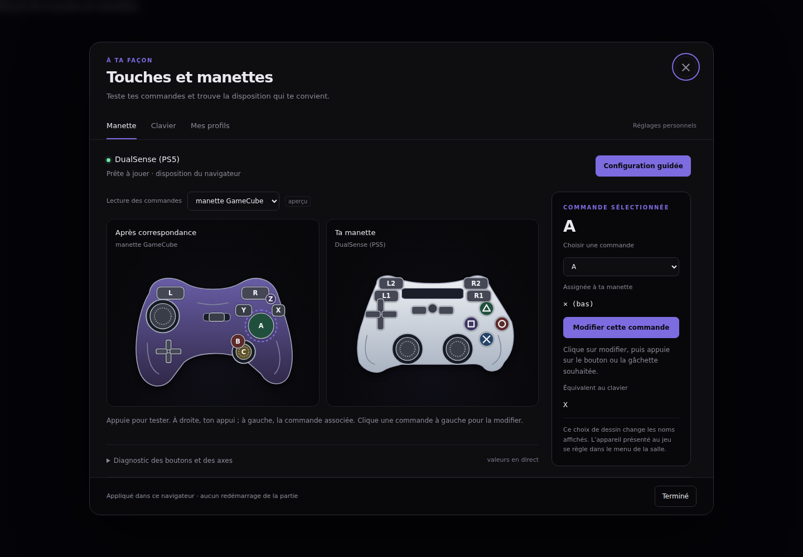
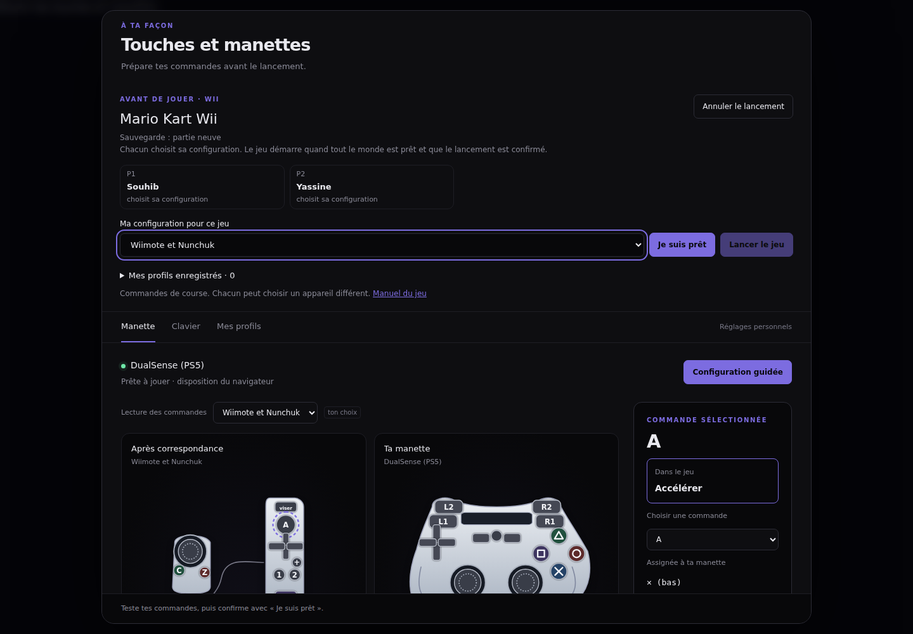

# Relecture de l’audit et audit du projet, 6 septembre 2026

**Lecture historique, complétée jusqu'au 9 septembre.** Les tableaux du premier
passage conservent le diagnostic à cette date. Le suivi en fin de page et
l'[état actuel du projet](etat-du-projet.md) décrivent les suites réalisées.
Une recommandation ancienne n'est donc pas nécessairement encore à faire.

L’audit du 5 septembre contient de vrais défauts. Son nombre de constats ne donne
cependant ni un nombre de pannes indépendantes, ni un ordre de travail fiable.
Je traiterais d’abord l’arrêt et le redémarrage du worker, les entrées non validées
du salon, puis l’état des manettes et les pertes de réglages. Je mesurerais le
réseau avant de changer le transport ou les paramètres d’encodage.

La demande comporte aussi une refonte du configurateur. Elle est réalisée dans
l’arbre de travail avec plusieurs corrections démontrées ci-dessous. Les autres
points restent des recommandations, et sont indiqués comme tels. Ce document
ne prétend pas que les 133 entrées restantes ont été corrigées.

## Méthode et limites

Référence de départ : commit `16eebcb`. Lecture de l’ADR, du carnet, de la note
sur les manettes, de l’historique Git et d’extraits des conversations locales
concernant ce projet. Ces conversations expliquent notamment la demande de
menus propres aux consoles et les problèmes rencontrés avec l’adaptateur
GameCube. Leur contenu privé n’est pas recopié dans le dépôt.

L’URL de l’artefact Claude n’a pas donné accès au contenu. Le texte intégral
fourni dans la conversation est la source de la relecture. Ses mentions
« déployé », ses anciens journaux et ses durées ne sont pas mes propres mesures.

La revue traverse les six crates Rust, les échanges entre le worker et Dolphin,
les frontières C/Vulkan, le transport, le plan de contrôle, la page, les scripts
de déploiement, les essais et les documents. C’est une revue des chemins et des
contrats, pas une preuve de chaque ligne ni un nouvel ensemble de seize audits.
Les contrôles exécutés complètent la lecture du code.

La commande `just` était verte avant les changements : 332 tests de page,
125 tests Python et 66 tests du lot GPU, en plus de la suite Rust ordinaire.
Une base verte n’exclut donc pas les défauts reproduits ensuite.

Au premier passage, aucun redémarrage de la salle en service, aucune suppression
de sauvegarde et aucun changement du trafic réseau de la machine. Les suites
du travail ont été déployées avec copie de retour et sont décrites dans le carnet. Les essais Chromium utilisent
la vraie interface et la vraie boucle d’entrée avec une manette simulée. Ils
ne valident ni un adaptateur USB réel, ni Firefox/Safari, ni une soirée de quatre
joueurs. Les essais GPU ne reproduisent pas une panne du pilote en pleine partie.

## Ce que je corrige dans la lecture de l’audit Claude

- **Les comptes se recouvrent.** Les 116 entrées « à faire » et les 17 questions
  expliquent les 133 affichées. `a15/a128`, `a93/a2`, `a105/a169`,
  `a151/a157`, `a158/a172` et plusieurs constats de README décrivent les mêmes
  mécanismes. Le nombre de regards n’est pas une mesure de gravité.
- **Une question n’est pas une panne démontrée.** `a175`, `a177`, `a178`,
  `a179`, `a183` et `a24` réclament une décision et une expérience. Leur présence
  dans le classement ne justifie pas à elle seule une réécriture.
- **La synthèse se contredit sur systemd.** `a157` attribue du bruit de panne à
  la ligne `SuccessExitStatus`, alors que `a151` distingue les sorties 143 des
  vrais échecs 1. J’ai reproduit les deux avertissements de syntaxe. Cela ne
  démontre pas que les échecs du journal étaient de faux échecs.
- **L’estimation des tampons n’est pas une observation de latence.** La réserve
  finale retire une partie de la force des affirmations de `a128/a15`. Les
  octets alloués et la latence à vide ne donnent pas le retard subi en saturation.
- **« Ne compte pas » ne signifie pas « faux ».** Plusieurs entrées réfutées
  décrivent du vrai code mort, de la documentation incorrecte ou des erreurs de
  contrat. Elles ont une priorité faible. En particulier, l’absence de joueur
  utilisant un lecteur d’écran ne prouve pas que les noms accessibles de `a113`
  sont suffisants : le menu est aussi une interface de configuration.
- **Une assertion derrière un `if` n’est pas toujours un défaut.** Il faut montrer
  que la précondition peut être fausse tout en laissant réussir l’essai. Cette
  distinction doit aussi s’appliquer aux tests proposés par les auditeurs.
- **Les choix déjà mesurés restent la référence.** Aucun élément nouveau ne
  justifie de retirer React du menu, de fusionner le salon dans le worker, de
  supprimer les trois styles de menu ou de remplacer TCP sans mesure.

## Priorités au premier passage

Ce tableau conserve le diagnostic initial. Depuis, les reçus de places et les
appareils par joueur sont traités par D16/D17, les reprises de rôle par D19, et
l'arrêt du worker par D20. `a152/a35/a36/a39` ont été éprouvés avec Dolphin réel
dans une salle isolée : arrêt éveillé et en pause, silence prolongé, puis orphelin.
`a75/a72` ont leurs correctifs et leurs essais de régression. Le défaut de `a75`
existait aussi avec une file de décodeur saturée, ce que la première proposition
de correction ne couvrait pas. `a28` a son ordre de destruction corrigé et son
commentaire de sûreté rectifié ; une panne du pilote graphique reste non reproduite.


| Priorité | Points | Verdict et preuve disponible | Action recommandée |
|---|---|---|---|
| 1 | `a152`, `a35`, `a36`, `a39` | Chaîne crédible et présente dans le code : le test d’intrus audio précède le nettoyage du conteneur, aucun gestionnaire SIGTERM ne conduit à l’arrêt ordonné, et `next_frame` peut attendre sans borne. L’unité installée annonce un délai d’arrêt de 90 secondes. Le scénario complet n’a pas été déclenché. | Traiter le cycle de vie comme un seul chantier. Conteneur de test isolé, arrêt éveillé et en pause, producteur muet et producteur actif, puis contrôle des sauvegardes. Garder la protection contre un émulateur étranger. |
| 1 | `a49`, `a48`, `a50` | `auth.name` arrive sans validation dans les présences. Un dictionnaire fait lever `PeopleController.sessions()` : reproduit sans réseau dans un dossier temporaire. Les charges d’événement non objet passent aussi la garde. Le fantôme de connexion relève encore d’une lecture de la chaîne d’exceptions. | Valider les types à la frontière socket.io et rendre la connexion transactionnelle : un échec retire la présence déjà créée. Tester qu’une deuxième personne peut encore recevoir la salle. |
| 2 | `a95`, `a93`, `a183`, `a2` | Le message du worker ne porte pas l’appareil réellement branché. La page décide de relancer depuis son choix local. La réaffirmation de l’extension personnelle est corrigée ici, mais pas cette divergence. | Publier l’appareil en cours depuis le worker. Séparer cet état, le choix du prochain lancement et l’extension personnelle. Tester un navigateur vierge dans une salle déjà en Wiimote. |
| 2 | `a75`, `a72` | Le premier décodeur muet échappe à la branche qui exige `lastOutput`. Le refus de demi-format n’a pas de remise à zéro. Confirmé à la lecture. | Tests avec un décodeur neuf qui reçoit sans produire et avec deux sessions de formats différents, puis corrections ciblées. |
| 2 | `a73`, `a74` | Le calcul de l’écart utilise `fastestLag`, alors que l’horaire vidéo ajoute aussi une marge et éventuellement le retard de synchronisation. La formule ne décrit pas l’image affichée. Aucune écoute comparative effectuée ici. | Tester la même chronologie pour le calcul et l’affichage. Montrer le retard réellement appliqué. Ne pas importer un plafond de gigue comme plafond arbitraire du son. |
| 2 | `a28` | Les images de `Pipeline` sont déclarées avant le convertisseur dont la destruction attend le GPU. L’attente ultérieure du contexte ne justifie pas une destruction antérieure. Les chemins normaux attendent déjà, les chemins d’erreur demandent une preuve. | Revoir ensemble l’ordre de destruction, la propriété des ressources et les erreurs d’attente. Ne pas considérer un test GPU nominal vert comme une preuve de ces chemins. |
| 2 | `a153`, `a155` | La copie `.bak` reste sur le même disque. L’unité exécute directement `target/release/nel3ab-worker`, ce qui fait d’un build un futur déploiement. Confirmé dans les fichiers. | Sauvegarde avec exercice de restauration et binaire de déploiement séparé des builds. Ne pas créer une tâche NAS sans choisir la rétention et les données à protéger. |
| 2 | `a175`, `a56`, `a67` | Le worker tient les places, le salon retient les annonces et les noms. L’invalidation après renommage peut réintroduire un état ancien. Ces contrats méritent des scénarios de course, pas seulement des comptes de lignes. | Conserver les processus séparés et exposer une occupation identifiable depuis le worker. Corriger le renommage avec un test de l’état final. |
| 3 | `a119`, `a124` | Le filtre Caddy d’identité est présent. L’en-tête reste prioritaire dans le service. Les paramètres globaux du lancement ont des contrats incomplets. La porte de secours (`a154`) est corrigée, voir ci-dessous. | Garder les tests de frontières et écrire la politique de secours. Soumettre les paramètres du lancement à la même autorité que le lancement, avec tests de deux sockets. |

Les durées de 47 ou 90 secondes annoncées dans l’ancien audit ne deviennent pas
ici des durées mesurées de redémarrage. `90 s` est la configuration lue, pas le
résultat d’un chronométrage d’interruption de la salle.

## Performance : des mesures avant des modifications

| Points | Mon avis |
|---|---|
| `a15`, `a128`, `a131`, `a132`, `a178` | Relever les octets en attente et les retransmissions sur les deux connexions du relais pendant un étranglement de débit. Corréler avec les rejets du worker et le retard de la page. Changer de transport sur la seule taille d’un tampon serait prématuré. |
| `a129`, `a179`, `c4` | Comparer le débit et la qualité sur plusieurs jeux et plusieurs spectateurs. Le demi-flux peut justifier un essai distinct de contrôle de débit. D15 n’autorise pas à dégrader le plein format pour cet essai. |
| `a130`, `a134`, `a135`, `a76` | Mesurer avant de changer les réglages du pilote, le tampon audio ou la fréquence d’entrée. Le trafic d’une trame de manette n’est pas tout son coût réseau, mais son nombre ne démontre pas un problème de batterie. |
| `a16`, `a80`, `a79` | La copie sous verrou et le redimensionnement systématique du canvas existent. Ils méritent des corrections isolées ou un profilage, pas une promesse de gain non mesuré. Le code jamais lu peut être retiré séparément. |
| `a133`, `a136`, `c8` | Une mesure absolue de latence, le suivi du poids de la page et la mémoire graphique seraient utiles. Ils n’ont pas le même enjeu : la mémoire graphique a déjà participé à une panne réelle du projet. |

Aucune conclusion nouvelle sur WebRTC, CBR, QP 26 ou la mémoire graphique en
charge n’est tirée des essais de cette modification.

## Corrections réalisées

| Sujet | Changement | Vérification |
|---|---|---|
| Écran des commandes, `a99/a100` | Trois sections : Manette, Clavier, Profils clavier. Un sélecteur de modèle, un titre cohérent et des portées explicites. | Chromium sur ordinateur et téléphone. |
| Dessins, `a105/a169` | Coques avec matière, boutons colorés, sticks mobiles, symboles PlayStation dessinés. Famille utilisée seulement si le navigateur garantit une disposition standard. Indices bruts pour un adaptateur inconnu. | Plans géométriques, rendu des vrais composants et captures. |
| Apprentissage, `a101/a102` | Leçon dans le dialogue, commande attendue éclairée, progression, passage et annulation visibles. Rétablir un adaptateur propose une leçon avant de commencer. | Pilote Chromium et machine d’apprentissage. |
| Capture d’un stick | Un bouton ne peut plus valider une demande d’axe. Le repos mesuré et le signe sont conservés. | Tests rouges sur les anciennes lectures, puis verts. |
| Capture et arrêt | Échap annule aussi une capture de manette. Débrancher annule la configuration. Arrêter annule l’animation et la reconnexion en attente. | Tests de la vraie boucle avec horloges et socket simulées. |
| Commandes involontaires | La leçon envoie un état neutre. Le dernier appui d’une assignation attend son relâchement avant de revenir au jeu ou au menu. | Test qui tenait réellement A dans la trame précédente et test du tour suivant. |
| Adaptateur inconnu | Une modification isolée ne crée pas quinze correspondances standard inventées. Un profil JSON mal formé ne casse plus la lecture. | Jumeaux manette standard/adaptateur, profils valides/invalides. |
| Plusieurs ports du même adaptateur | L’écran lit les ports du modèle choisi, comme la capture. Un autre modèle n’est pas mélangé à son diagnostic. | Troisième port actif, puis même port changé vers un autre identifiant. |
| Clavier | Quatre directions assignables et aperçu clavier vers manette. Stick distinct de la croix ; actions du jeu dans la table. | Quatre flèches capturées dans Chromium, sens des sticks, touches opposées, relâchement, Ctrl assigné et focus des champs. |
| Profils | Copie nommée, noms invalides refusés, dernière disposition personnelle protégée, portée de publication et erreur visibles. | Chromium et tests de stockage. |
| Réglages hors ligne, `a58` | Copie en attente par identité. Envois ordonnés dans l’onglet, confirmation conditionnée à la version envoyée, reprise au chargement. | Erreur réseau, nouveau module simulant une visite, réponse ancienne et changement d’identité. |
| Persistance concurrente, `a53` | Verrou autour de la mutation et de l’écriture des pseudos, profils personnels et référence. | Trois courses déterministes : deux écritures entraient ensemble avant le correctif, une seule après. Le contenu final et la copie précédente sont vérifiés. |
| Extension, partie de `a2` | Chaque nouvelle attribution de socket réaffirme l’extension personnelle. Une simple mise à jour de l’occupation ne la renvoie pas. | Guitare puis Nunchuk, reconnexion et message d’occupation intermédiaire. |
| Menus, `a84/a85/a87` | Haut/bas conserve la colonne aux limites de la grille Wii. La sélection défile dans la zone visible. Les réglages Switch portent leur nom sur chaque tuile. | Hook testé, puis quatorze entrées réelles dans Chromium : aller-retour entre première et dernière ligne à 1280 × 720 et 844 × 390. Les quatorze libellés Switch sont vérifiés. |
| Contraste du banc | Un échec de contraste renvoie désormais un code d’échec. | 31 textes volontairement illisibles : ancien pilote à zéro, pilote corrigé à un. Couleur de contrôle retirée. |
| Unité, `a151` et partie de `a157` | Retrait des deux lignes hors section et des commentaires contredisant les valeurs en usage. | `systemd-analyze verify` : deux avertissements avant, aucun après. Fichier installé inchangé. |

Les nouveaux tests de capture ont d’abord échoué contre le comportement ancien.
Le remettre ensuite en place a fait échouer 13 des 14 tests de la boucle.
Remettre l’ancien contrôleur de profils a aussi fait échouer ses deux courses,
tout en laissant vert le test du contrôleur de pseudos resté corrigé.
Remettre l'ancienne grille Wii a fait échouer l'attente de visibilité de la
dernière ligne, alors que sa sélection avait bien changé. La grille corrigée
a ensuite été rétablie et le même pilote relancé.
La première tentative de leur montage échouait aussi parce que jsdom ne fournit
pas `getGamepads`. Cet échec d’environnement n’a pas été compté comme preuve du
bogue : la manette simulée a été installée avant d’observer les assertions rouges.

La copie locale en attente ne remplace pas une sauvegarde du serveur. Elle ne
résout pas les écritures concurrentes de deux onglets ou deux appareils : le
serveur conserve le dernier envoi reçu. Une indisponibilité du stockage privé du
navigateur et une indisponibilité réseau simultanées restent une limite.

## Suite de la demande : places et préparation collective

Les priorités sur les places et les appareils ci-dessus ont été traitées dans
le même arbre de travail après les signalements de Souhib. `a175`, `a2`, `a93`,
`a95` et la partie appareil de `a183` ont désormais un protocole explicite :
attribution par connexion, lecture des quatre places par le salon, appareil
publié par le worker, puis préparation Wii avec un choix par port. Cela ne
fusionne pas les deux processus et ne déplace pas la boucle média dans React.

`a67` a été reproduit par un test : l'ancien pseudo était l'état final après
la poussée du salon. L'invalidation concurrente a été retirée. Les noms de prises
n'utilisent plus « occupé » ; une couronne montre le chef et la colonne contient
les spectateurs. La réintroduction de l'ancienne conservation des attributions
fait rougir les scénarios de départ et de reconnexion.

`a48`, `a49`, `a50` ont également des corrections : pseudo typé et borné,
charges non-objets refusées, retrait de la présence si la connexion ne peut pas
être diffusée. Le travail ne prétend pas rendre infaillible tout gestionnaire
Socket.IO. Les erreurs générales d'exploitation du worker restent ouvertes.

La limite des profils est calculée sur les mêmes octets JSON compacts dans la
page et le service. Deux tests rouges ont montré l'ancien écart : un ensemble
ASCII accepté par le navigateur était refusé à cause des espaces ajoutés par
Python ; des caractères Unicode dépassant la limite en octets passaient le
compteur de caractères. Les deux frontières sont maintenant vérifiées.

La préparation accepte des profils personnels nommés, avec appareil, disposition
physique et touches. Le lancement est refusé jusqu'à la confirmation de tous les
présents. Le worker vérifie à nouveau les attributions et le droit de décider.
Le chargement des correspondances ne pousse aucun bouton dans le jeu en cours.
La réintroduction de ce dernier défaut fait échouer le test qui observe la trame.

Sources consultées le 6 septembre : [Mario Kart Wii](https://csassets.nintendo.com/noaext/image/private/t_KA_PDF/Wii_Mario_Kart),
[Mario Strikers Charged](https://csassets.nintendo.com/noaext/image/private/t_KA_PDF/Wii_Mario_Strikers_Charged),
[Mario Party 8](https://csassets.nintendo.com/noaext/image/private/t_KA_PDF/Wii_Mario_Party_8)
et [Mario Party 9](https://csassets.nintendo.com/noaext/image/private/t_KA_PDF/Wii_Mario_Party_9).
La fiche Guitar Hero garde ses correspondances Dolphin et indique que le manuel
éditeur n'a pas été vérifié. Le PDF trouvé sur un miroir n'a pas pu être lu de
façon fiable. Le README d'Obscura a été consulté ; les sources Nintendo étaient
accessibles directement et n'ont pas nécessité son installation.

Une salle temporaire avec le vrai Dolphin a ensuite été vérifiée : Mario Kart
Wii reconnaît GameCube en P1 et Wiimote avec Nunchuk en P2, puis l'inverse après
un lancement collectif. Les commandes traversent deux navigateurs distincts.
Ce n'est pas une course entière avec deux appareils physiques, ni une preuve
des gestes de tous les mini-jeux. Le trio page, plan de contrôle et worker doit être
publié ensemble pour la préparation. Aucun service en place n'a été remplacé,
aucun binaire release n'a été compilé dans le chemin de déploiement et aucun
commit n'a été créé.

Le pilote `preparation-room.mjs` a trouvé trois défauts supplémentaires de cette
implémentation : le brouillon ne suivait pas l'appareil annoncé à un navigateur
neuf ; les profils complets étaient omis lors du chargement initial depuis le
service ; la limite de fréquence empêchait d'enchaîner « prêt » puis « lancer ».
Les trois sont corrigés avec des tests qui échouent sur le comportement précédent.
Le parcours Chromium utilise maintenant le vrai salon, un worker et Dolphin
temporaires, sans changer la salle en service. Il vérifie aussi le profil depuis
un second navigateur et les noms après restitution et reprise d'une manette.
Le retour des images chez les deux joueurs a pris 5 280 ms sur le passage réussi
du 6 septembre. C'est un essai local automatisé, pas une mesure de latence chez
un ami ni une moyenne de plusieurs soirées.

## Les autres familles de constats

| Domaine | Points représentatifs | Triage |
|---|---|---|
| Documentation d’entrée | `a162/a163/a54`, `a164`, `a166/a167/a168`, `a170/a174/a186`, `c5` | Dette réelle, à dater et aligner sur les sources. Les textes historiques doivent rester historiques. Une note de reprise périmée coûte davantage qu’un commentaire ancien sans lecteur. |
| Inventaire des essais | `a140/a144/a150`, `a141/a142/a147/a148`, `a171`, `a37` | Bons chantiers ciblés. Tester les vrais contrats et faire échouer le comportement ancien. Un index de pilotes ne les transforme pas en tests exécutés par CI. |
| Qualité et dépendances | `a146`, `a126`, `c3/c6` | `just check` couvre le job principal de CI, pas ses jobs documents et dépendances. Les outils hors de `control/` ne sont pas tous lintés. Ne pas annoncer une porte unique plus large que son exécution. |
| Code mort et artefacts | `a63/a79/a92`, `a159`, `c2/c7` | Nettoyage légitime, de faible urgence. Les fichiers Dolphin et les captures suivis sont présents. Ne pas supprimer en bloc des mesures ou des patches sans vérifier leur usage. |
| Frontières Rust | `a3/a4/a6`, `a27/a30/a31/a34`, `a43` | Les simplifications de types et les preuves de layout sont utiles. Du code FFI absent du chemin produit est moins urgent, mais une promesse de sûreté fausse reste fausse. Miri ne prouve pas les appels GPU. |
| Exploitation | `a160/a161`, `a24/a25/a26`, `a177`, `c8` | Runbook et suivi nécessaires. La suppression du patch 0002 ou la relance de Dolphin dans le même worker demandent une expérience et une décision écrite. |
| Sécurité d’hôte | `a120/a121/a122/a123` | Le conteneur d’outil n’a effectivement pas les protections du lecteur. Les services partagent le compte. Priorité inférieure aux entrées du salon et à la restauration, avec un rayon d’impact plus large. |
| Messages d’interface | `a106/a107/a108/a109/a111/a112/a114/a115/a117` | Plusieurs textes sont incorrects ou insuffisants. Séparer explicitement reconnexion, chargement demandé, worker seul et indisponibilité complète. Ce travail n’est pas inclus dans la refonte du configurateur. |
| Confort des menus | `a82/a83/a86/a88/a91/a92`, `a97/a98` | Ouverture physique, entrée au pad, mouvement réduit et parité des informations restent utiles. Aucun ne justifie de supprimer les styles demandés par le propriétaire. |
| Dépôt et licence | `c1` | L’absence de fichier LICENSE est vérifiée. Ajouter le texte correspondant à la licence annoncée relève d’un changement de documentation du dépôt, pas d’une réparation de la salle. Aucune conclusion juridique supplémentaire ici. |

Ce tableau classe les propositions restantes. Il ne certifie pas chacun des
numéros de ligne et chacun des scénarios de l’audit original.

## Incident des noms pendant la partie, 6 septembre

Le salon en marche refusait en 403 les connexions venues de la porte
`lgf.tail3bd01c.ts.net:8443`, alors que cette même porte donnait bien accès à
l'image et aux manettes. Le défaut `a154` est confirmé par une poignée de main
refusée pour cette origine et acceptée pour `nel3ab.app`. L'adresse effectivement
utilisée par l'ami n'a pas été communiquée, mais l'intervention sur la liste
résout les refus observés : finfin apparaît en P2 et lu en P3.

La liste installée accepte maintenant exactement les deux portes de jeu.
Le test lit le fichier d'unité et vérifie aussi le refus d'un site étranger
et du port de documentation. Le service du salon a été redémarré après ses
180 tests ; aucun redémarrage du worker n'a été demandé. Les modifications
Python préparées dans cet arbre sont donc également chargées par le salon.

Le second défaut apparaît sur la page de Souhib, qui reste connectée au jeu :
elle ne réannonce pas sa place après la reconnexion du salon. Le correctif de
page renvoie la place actuelle au retour du salon puis périodiquement, sans
rejouer les places abandonnées pendant la coupure. Deux tests vérifient ces
transitions ; ils échouent lorsqu'on retire la réannonce. Les numéros P1 à P4
restent aussi visibles sur sa propre prise, avec le nom en dessous. Cette page
reconstruite n'était pas encore servie par le worker lors de cette intervention. Une lecture
ultérieure confirme finfin en P1, lu en P2 et Souhib en P3, toujours sur le
même worker : leurs annonces sont revenues avec les changements de places.
Une future reconnexion isolée du salon peut encore nécessiter une actualisation
sur l'ancienne page ; la nouvelle page traite ce cas automatiquement.

## Validation de cette modification

Les analyses de dépendances effectuées le 6 septembre ne signalent aucun avis
connu pour les dépendances de production Python et npm. `just audit` accepte
aussi les dépendances Rust selon la politique du dépôt. Cela ne couvre pas les
paquets du conteneur Dolphin ni toutes les dépendances de développement Python/npm.

La porte complète `just` est verte : 341 tests Rust, 180 Python, 397 de la page
et 66 du lot GPU. Les pilotes Chromium de configuration et de préparation,
le banc visuel, la documentation stricte et `just audit` passent également.
La page pèse 138 953 octets brotli, sous le plafond de 140 000. Ce résultat ne vaut pas
une CI distante : aucun commit ni envoi n'a été demandé.

Le contrôle des fichiers générés compare normalement l'arbre à l'index Git.
Comme les nouveaux schémas sont volontairement non commités, la porte a tourné
avec un index Git temporaire contenant ces schémas. Elle les a régénérés puis
comparés à cette copie. L'index de travail de la personne est resté intact.
C'est une vérification de reproductibilité, pas une suppression du contrôle.

Les commandes de reprise, après avoir préparé l'index de ces fichiers, sont :

```sh
just front-build
just
just browser-configuration
just browser-preparation
just preparation-test '/chemin/Mario Kart Wii.rvz'
just banc-visuel
just docs
just audit
```

`browser-configuration` demande Vite sur le port 5202 et produit ses captures
dans `/tmp/nel3ab-configuration`. `banc-visuel` lance son propre aperçu isolé.
Les pilotes historiques qui demandent une salle n’ont pas été lancés contre une
ancienne page de production en prétendant vérifier la nouvelle.
`preparation-test` demande Docker, le GPU, Caddy, les dépendances locales et le
disque indiqué. Il construit le binaire de développement puis crée ses propres
ports, conteneur et sauvegardes. Il ferme ses processus même sur une assertion
en échec ; les traces restent dans le dossier temporaire annoncé.

Après une arrivée sur une partie déjà lancée, la page ne connaît pas encore
l'emplacement de sauvegarde de ce lancement. Un changement d'appareil qui
nécessiterait un redémarrage renvoie alors au choix de sauvegarde dans la
bibliothèque, au lieu de deviner « partie neuve ». Les pages qui ont assisté au
lancement reçoivent maintenant aussi le code explicite de cet emplacement.

Le changement n’installe pas de binaire, ne recharge pas les unités systemd et
ne crée pas de commit. Le service en cours continue donc à utiliser sa page
compilée précédente jusqu’à un déploiement explicite.

## Aperçus

Le vrai configurateur dans Chromium, avec une DualSense simulée. Aucune image
de jeu ni donnée de joueur n'est utilisée pour ces captures.



[Voir l'apprentissage sur téléphone](images/touches-mobile-2026-09-06.png).



[Voir la préparation sur téléphone](images/preparation-mobile-2026-09-06.png).
Les deux noms de cette préparation appartiennent à sa fixture simulée, sans
lecture d'une séance réelle.

## Mise en service à 15 h 54 UTC

Le worker sert maintenant la nouvelle page et le protocole de places avec reçu.
Le binaire en cours porte l'empreinte `f544c35740b8`, processus 776837 au lancement.
Super Mario Strikers reprend ; les fichiers persistants et l'ancien binaire sont
copiés dans `~/.local/state/nel3ab/deployments/20260906T155432Z`.
Le lancement collectif Wii est rejoué en salle isolée : Wiimote/Nunchuk pour un
joueur et GameCube pour l'autre, profils et places conservés. Les images reviennent
en 5 664 ms sur ce passage local automatisé. La vraie porte `nel3ab.app` sert
l'artefact au bon hash, avec vidéo, configurateur GameCube sans sélecteur Wii et
aperçu clavier vérifiés depuis une page spectatrice.

Les onglets ouverts avant ce déploiement gardent l'ancien code, ses libellés
« toi »/« occupé » et ses annonces sans reçu. Le salon ne peut pas rattacher leurs
noms à la nouvelle occupation vérifiée. Une actualisation de chaque ancienne page
est nécessaire pour cette migration. Ce cas a été signalé par Souhib après la
relance ; les essais entre pages neuves ne démontraient pas la migration d'onglets
anciens. Le retour des noms sur leurs appareils n'est pas déclaré vérifié avant
cette actualisation. Il n'y a pas de nouveau commit ni de CI distante.

## Clips avec audio, 6 septembre à 16 h 38 UTC

Un nouveau défaut signalé par Souhib est reproduit sur le fichier de la salle :
le clip ne contenait aucune piste sonore. Le stockage et le multiplexage
omettaient l'audio. Le worker conserve maintenant le PCM borné, coupe le son sur
les horodatages vidéo et encode une piste AAC lors de l'export. La sélection du
clip partage ses données pour libérer le verrou avant les copies et l'encodage.
Un export dont le son manque rend une erreur explicite.

Les tests échouent quand le stockage du son ou sa piste MP4 sont retirés.
`just` inclut maintenant un export réel de signal connu, décodé avec ffmpeg.
La porte complète passe : 347 tests Rust, 180 Python, 397 de la page, 66 GPU,
puis ce test audio supplémentaire. Le worker installé porte l'empreinte
`480c0cb06a00`. Sur la vraie salle, un clip de Mario Power Tennis de 32,6 s
contient H.264 et AAC stéréo 48 kHz, de durées concordantes ; son décodage donne
un signal non nul. Aucun test manuel d'écoute comparative n'est revendiqué.
La page reste identique à celle déjà installée, sans nouvelle migration d'onglets.

Le signalement suivant, à 17 h 20 UTC, montre un autre défaut du rapprochement :
une réponse manquante du worker effaçait les noms, et une personne sans attribution
confirmée était rangée parmi les spectateurs. Corrigé à 17 h 34 : la dernière
lecture complète est conservée jusqu'à la suivante, le mode spectateur demande
une annonce explicite, les attributions en attente restent distinctes. Les tests
échouent en réintroduisant les deux défauts. La porte locale complète passe.
La vérification sur le vrai site retrouve Souhib en P3 et laisse finfin en
attente avec sa couronne. Sa visite antérieure au déploiement doit encore être
actualisée pour transmettre son reçu ; aucun nom n'est associé par élimination.

## Suivi de la relecture, 9 septembre 2026

Ce tableau relie les suites de la conversation aux familles de constats. Il ne
recompte pas les 194 identifiants comme des défauts indépendants et ne prétend
pas les avoir tous revérifiés sur l'état du 9 septembre. Les preuves détaillées,
leurs dates et leurs limites restent dans le carnet et dans l'ADR.

| Sujet de l'audit | Suite réalisée | Limite à conserver |
|---|---|---|
| Arrêt et redémarrage, `a35/a36/a39/a152` | D20 : arrêt demandé parcourant le nettoyage, réveil avant arrêt, silence éveillé borné, statut de sortie journalisé, nettoyage de l'orphelin propre à la salle. Parcours joués avec Dolphin isolé. | Ne prouve pas chaque panne de pilote. La capture Switch a sa propre reprise ; elle ne détecte pas toute émulation figée. |
| Places, appareils et profils, `a175/a2/a93/a95/a183` | D16/D17 : reçus d'attribution, appareil par place, préparation collective, profils personnels. Les retours des joueurs ont ajouté la distinction entre lecture manquante, attribution en attente et spectateur explicite. | Les changements ont demandé une actualisation des anciennes pages. Le format vidéo reste un choix par spectateur, pas un état global de la salle. |
| Décodeur et son/image, `a72/a75/a73/a74` | Réinitialisation du refus de format, surveillance d'un premier décodeur muet, calcul aligné sur l'horaire réellement appliqué, actualisation de la synchronisation sonore. | Les chronologies et les essais ne constituent pas une écoute comparative sur tous les appareils. Le navigateur Zen sous Windows reste un problème distinct, non résolu. |
| Configurateur, `a97/a99/a100/a101/a102/a105/a169` | Refonte des dessins, apprentissage visible, clavier vers manette, flèches distinctes pour croix et stick, titres et portée clarifiés. Correspondances ouvertes sur une colonne, diagnostic fermé. | Les fiches de commandes n'existent que pour les jeux renseignés ; elles ne prétendent pas décrire chaque mini-jeu Mario Party. |
| Clip et verrou, `a16` puis signalement de clip muet | Données partagées lors de la sélection, copie hors verrou, piste audio et export vérifié par décodage. | Le signal non nul d'un clip réel ne remplace pas l'écoute de toute sa durée. |
| Porte de secours, `a154` | Origines admises pour les deux adresses, puis diagnostic et correction de l'accès des invités au port 443. Souhib a confirmé le retour de `nel3ab.app`. | Le domaine reste privé sur Tailscale. Les mesures depuis lgf seules ne prouvaient pas l'accès d'un ami. |
| Documents périmés, `c5/a162/a163/a54/a105/a169` | README, index, note du configurateur et guide du salon corrigés ; plans datés comme archives ; modifications de décisions reliées à l'ADR. | Les récits historiques gardent leurs conclusions d'origine, avec renvoi vers les corrections. |
| Réseau et débit, `a15/a128/a129/a179` | Mesure d'une scène Wii animée : le demi-format à qualité constante peut encore dépasser 5 Mbit/s. | Le test n'a pas choisi ni validé un nouveau contrôle de débit. Une comparaison WebRTC ou un réglage CBR reste une expérience à faire. |
| Copies et déploiement, `a153/a155` | Copies locales des états lors des interventions ; emplacements Switch verrouillés, copies et restauration essayées. | Aucune sauvegarde hors du disque démontrée. Le service vise toujours le binaire de construction ; un déploiement séparé reste à traiter. |

Les autres demandes ont aussi produit des ajouts, plutôt que des corrections
du premier audit : couronne du chef, liste des spectateurs, récupération explicite
du rôle ou d'une place, salle ouverte sans jeu, messages temporaires au branchement
et intégration Switch. L'[état du projet](etat-du-projet.md) les indexe avec les
pistes écartées. Aucun nouveau total de constats « corrigés » n'est déduit de ce
tableau, et aucun résultat de CI distante n'est revendiqué sans commit envoyé.
