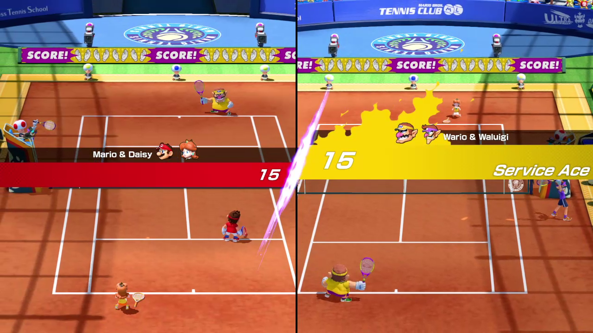

# Ajouter la Switch à nel3ab : étude du 7 septembre 2026

**Reprise au 9 septembre : l'adaptateur Switch est maintenant installé dans la
salle commune.** Le [guide Switch](switch-room.md) décrit son fonctionnement
actuel et ses limites. Les sections ci-dessous conservent l'étude et les essais
des 7 et 8 septembre, avec leurs conclusions à ces dates. Les mentions « reste
à intégrer » y sont historiques ; la dernière section explique leur remplacement.

L'ajout paraît réalisable. Il demande un deuxième moteur d'émulation et une
nouvelle entrée pour les images, le son et les commandes. Ce n'est pas un ajout
de disques au dossier Dolphin : [Dolphin émule la GameCube et la Wii](https://github.com/dolphin-emu/dolphin).

**Le prototype Ryubing exécute maintenant un match de Mario Tennis Aces 3.1.0
à quatre, commandé depuis quatre pages Chrome, avec son et clip.** La
sauvegarde de l'aventure se recharge après redémarrage. Le second passage du
8 septembre corrige la limite de mémoire partagée du conteneur. Un nouveau
relevé donne 52,4 images/s médianes avec quatre navigateurs sur le serveur,
puis 60,1 sans capture ni navigateur. Les deux charges ne sont pas séparées.
Le correctif local ferme normalement le moteur sans interface ; un plantage
reste observé avec le profilage graphique activé. La page de test est accessible sur le tailnet ; le raccordement
à la salle normale reste à faire. Les premières sections conservent l'étude
initiale et les mesures détaillées figurent plus bas.

## Le dépôt dolphin-switch de xerpi

Le dépôt précis [xerpi/dolphin-switch](https://github.com/xerpi/dolphin-switch)
a été vérifié après le lien fourni par Souhib. Il porte Dolphin sur la console
Nintendo Switch. La machine qui exécute l'émulateur est donc la Switch ; les
consoles émulées restent la GameCube et la Wii. Son README conserve cette
fonction et ajoute des instructions de compilation pour Switch avec devkitPro
et libnx, les outils de développement destinés à cette console.

Ce dépôt ne fournit pas de moteur pour exécuter des jeux Switch sur lgf. Il
n'apporte donc pas la fonction recherchée pour nel3ab. Il n'avait pas été
examiné séparément dans la première version de cette étude ; cette vérification
précise maintenant pourquoi il est écarté. Aucun essai de ce portage sur une
console Switch n'a été effectué.

## Ce qui a été vérifié

Le serveur lgf possède un Ryzen 5 3600, six cœurs et douze fils d'exécution,
64 Go de mémoire et une Radeon RX 6650 XT avec environ 8 Go de mémoire graphique.
Relevé local par `lscpu`, `free`, `lspci` et les compteurs du pilote le 7 septembre.
Il ne faut pas le confondre avec le PC Windows équipé de la RX 7900 XTX.

La [documentation Ryubing](https://docs.ryujinx.app/guides/setup-guide/#system-requirements)
cite justement le Ryzen 5 3600, 16 Go et une GTX 1060 6 Go comme configuration de
référence à la résolution et à la cadence natives. Le serveur mérite donc un
essai. Cela ne prouve ni quatre joueurs fluides, ni le coût de notre conversion
vidéo et de nos deux encodeurs. La traduction des instructions de la console,
la compilation des programmes graphiques et les scènes complexes peuvent
solliciter le processeur même lorsque la carte graphique dispose encore de place.
Les [exigences Eden](https://eden-emu.dev/system-requirements/) restent elles aussi
une indication générale, pas une garantie par jeu.

Au moment de cette première lecture, aucun jeu Switch n'avait été lancé ni
mesuré. Les expériences des 7 et 8 septembre complètent cette étude ; aucun
moteur Switch n'est encore installé dans la salle en service.

## Les moteurs comparés

| Moteur | État observé | Intérêt pour nel3ab | Réserve |
| --- | --- | --- | --- |
| **Ryubing / Ryujinx** | Version 1.3.3 publiée le 11 octobre 2025 ; développement observé jusqu'au 26 août 2026. | Lancement sans interface de configuration, dossier de données distinct, identifiant et profil de commande par joueur. Code C#, licence MIT. | Les anciens liens GitHub des documents ne répondent plus. Épingler les sources et le binaire du dépôt actuel ; ne pas dépendre d'un lien `latest`. |
| **Eden** | Version stable 0.2.1 publiée le 1er juin 2026 ; dépôt encore modifié en septembre. | Linux, Vulkan et lanceur SDL ; configuration et profil utilisateur sélectionnables au lancement. Bon candidat pour comparer la vitesse et la compatibilité. | Ses profils de commandes et son export d'images demandent un adaptateur propre. Licence GPL v3 ou ultérieure. |
| **Citron Neo** | Version publiée le 27 avril 2026. | Autre descendant de Yuzu, code disponible et lanceur SDL. | Pas de mesure ni de fonction d'intégration identifiée qui justifie un troisième moteur dès le premier prototype. À garder comme solution de comparaison si un jeu résiste aux deux premiers. |

Sources des versions : [Ryubing 1.3.3](https://git.ryujinx.app/projects/Ryubing/releases/tag/1.3.3),
[activité Ryubing](https://git.ryujinx.app/projects/Ryubing/commit/475615f0431b4995b03c930c5089d20f6f3570e0),
[Eden 0.2.1](https://git.eden-emu.dev/eden-emu/eden/releases/tag/v0.2.1),
[Citron Neo](https://github.com/citron-neo/emulator/releases/tag/2026-04-27).
Les licences sont déclarées dans les [sources Ryubing](https://git.ryujinx.app/projects/Ryubing/src/tag/1.3.3/README.md)
et les [sources Eden](https://git.eden-emu.dev/eden-emu/eden).

Ce ne sont pas seulement des interfaces de bureau que l'on devrait piloter à
la souris. Dans Ryubing 1.3.3, [`Program.cs`](https://git.ryujinx.app/projects/Ryubing/src/tag/1.3.3/src/Ryujinx/Program.cs)
reconnaît `--no-gui`. Ses [options](https://git.ryujinx.app/projects/Ryubing/src/tag/1.3.3/src/Ryujinx/Headless/Options.cs)
comprennent `--root-data-dir`, `--profile`, `--input-id-1` à `--input-id-8` et
`--input-profile-1` à `--input-profile-8`. Attention au vocabulaire : le profil
utilisateur de la console n'est pas le profil de boutons d'un joueur.

Le [lanceur Eden](https://git.eden-emu.dev/eden-emu/eden/src/tag/v0.2.1/src/yuzu_cmd/yuzu.cpp)
accepte notamment `--config`, `--fullscreen` et `--user`. Son
[lecteur de configuration SDL](https://git.eden-emu.dev/eden-emu/eden/src/tag/v0.2.1/src/yuzu_cmd/sdl_config.cpp)
charge les réglages des différents joueurs. SDL est la bibliothèque qui lui
fournit fenêtre, son et manettes. « Sans interface de configuration » ne signifie
pas « sans fenêtre graphique » : les deux moteurs ont encore besoin d'une sortie
de rendu, que la salle devra capturer.

## Ce que l'on peut garder, et ce qu'il faut ajouter

Le salon, les identités, les quatre places, les spectateurs, la préparation
collective et les profils personnels restent utiles. Un seul émulateur Switch
ferait tourner le multijoueur local, avec la même image envoyée à tous. Les
joueurs n'auraient aucun émulateur à installer. Les modes de connexion entre
plusieurs consoles, souvent appelés LDN, ne sont pas nécessaires à ce modèle.

Il faut ajouter un adaptateur Switch à cinq endroits :

1. **Démarrage et catalogue.** Reconnaître les titres Switch, retenir leur
   identifiant stable, leurs mises à jour et contenus additionnels. Démarrer le
   moteur choisi dans un conteneur et un dossier de données propres.
2. **Commandes.** Présenter quatre manettes virtuelles distinctes au moteur,
   vraisemblablement par `uinput`, l'interface Linux qui crée des périphériques
   d'entrée. Élargir notre trame GameCube : la Switch possède notamment deux
   boutons de stick, plus et moins, et deux gâchettes distinctes. Donner un type
   au protocole, au lieu de réutiliser des bits avec deux sens.
3. **Images.** Tester d'abord une fenêtre Vulkan dans un affichage virtuel isolé,
   puis récupérer son image avec un mécanisme compatible avec notre encodeur.
   La conversion et H.264 sont réutilisables ; le patch Dolphin qui exporte
   directement sa mémoire graphique ne l'est pas. Un export équivalent dans le
   moteur Switch serait une seconde étape, justifiée par la mesure du coût de
   capture et par son coût d'entretien.
4. **Son et clips.** Récupérer uniquement la sortie de cette instance, avec des
   dates compatibles avec celles des images. Rejouer la preuve du clip stéréo
   et vérifier l'alignement ; capturer le son global du serveur serait incorrect.
5. **Sauvegardes et arrêt.** Isoler chaque titre et chaque compte de console,
   conserver le cache graphique entre visites et arrêter proprement le moteur.
   Les cartes mémoire GameCube et la mémoire Wii ne décrivent pas ces données.

Une capture provisoire qui repasse par le processeur convient pour une première
preuve, pas pour affirmer que la latence de Dolphin sera conservée. À 1280×720,
60 images/s et quatre octets par pixel, une seule copie représente environ
221 Mo/s : calcul de volume, pas mesure de durée. Le passage direct entre
mémoires graphiques devra être étudié avec le moteur retenu.

## Les jeux à essayer en premier

Faute de liste plus précise, je retiens Mario Kart 8 Deluxe, Super Smash Bros.
Ultimate et Mario Party Superstars comme premiers candidats. Leur disponibilité
dans un émulateur ne suffit pas : il faut essayer leurs modes locaux à quatre,
les menus, les sauvegardes et les reconnexions de manettes.

Pour Mario Party, **Superstars est le meilleur premier candidat** : Nintendo
précise que [tous ses mini-jeux utilisent les boutons](https://mariopartysuperstars.nintendo.com/fr/minigames/)
et que [quatre joueurs peuvent partager une console](https://en-americas-support.nintendo.com/app/answers/detail/a_id/56964/p/897/c/871).
Super Mario Party utilise aussi des [commandes par mouvements des Joy-Con](https://media.nintendo.com/supermarioparty/minigames/),
que notre entrée navigateur ne transmet pas aujourd'hui. Il faut donc le traiter
comme une étape distincte, avec une liste de modes réellement jouables.

Le matériel nécessaire à l'essai comprend les copies de jeux, les données système
et les clés provenant de la console de l'utilisateur, comme l'indique le
[guide de configuration Ryubing](https://docs.ryujinx.app/guides/setup-guide/).
Aucun de ces fichiers n'a été recherché ou téléchargé pour cette étude.

## Expérience qui permettra de choisir

Créer une salle expérimentale isolée, sans modifier le moteur de la salle
actuelle. Comparer une version épinglée de Ryubing et Eden, avec les mêmes jeux,
la même résolution et les mêmes quatre manettes. Faire un passage avec cache
vide, puis un passage avec cache conservé : cela sépare le coût de compilation
du coût normal d'une partie.

Pour chaque jeu, relever pendant une vraie partie la cadence, les pauses longues,
le temps d'encodage, l'utilisation mémoire, le débit et le délai entre un appui et
sa réaction visible. Refaire le passage avec plusieurs navigateurs et un client
limité à 5 Mbit/s. Tester aussi quitter, revenir, passer spectateur, changer de
jeu et récupérer la sauvegarde après un redémarrage. Une cinématique ou un menu
animé ne valide pas une course à quatre.

Le moteur choisi sera celui qui tient ces parcours et la cadence attendue avec
le moins de modifications propres à nel3ab. Si les deux échouent sur le Ryzen,
mesurer d'abord l'étage saturé avant de proposer un achat. À ce stade, l'ajout
Switch est une piste concrète et raisonnable ; annoncer une intégration prête
à jouer ou promettre 60 images/s serait prématuré.

## Résultats des prototypes, le soir du 7 septembre

Le dossier de reproduction `spikes/switch-room/README.md` contient le
programme Switch, les quatre manettes virtuelles, les lanceurs des deux moteurs,
le pont vers le transport réel et les pilotes de vérification. Les empreintes
et résultats numériques sont dans le relevé
`spikes/switch-room/results/2026-09-07.json` du dépôt.

Ryubing 1.3.3 fonctionne avec la Radeon RX 6650 XT et le mode mémoire
`SoftwarePageTable`. Son mode mémoire par défaut a produit une violation d'accès
sur ce programme. Xvfb, un écran X11 en mémoire, n'offre pas la présentation
Vulkan attendue : le moteur retombait sur llvmpipe, qui dessine avec le
processeur. Cage, un compositeur Wayland lancé sans écran physique, permet
l'emploi du vrai GPU. wf-recorder capture ensuite l'image et l'encode avec
VA-API. Son journal annonce le chemin DMA-BUF ; celui-ci n'a pas encore été
profilé pour vérifier chaque copie.

Le programme invité produit quatre zones, des marqueurs de boutons et de sticks,
un compteur d'images, un compteur persistant et deux sons. Le compteur d'images
avance de 306 en 5,09 secondes, environ 60 images/s. Ce dessin de rectangles ne
mesure pas le coût d'un jeu commercial. Le retour au neutre après la disparition
des commandes est observé en 1,07 à 1,14 seconde, autour du délai d'une seconde
fixé dans le helper. Cette valeur appartient au prototype, pas au worker normal.

Quatre contextes Chrome prennent les quatre places. Chaque appui ne change que
la zone du joueur concerné. Une vibration remonte à l'API de sa page. Cette API
est simulée dans le pilote : aucune vibration physique n'a été ressentie. Le
passage en spectateur libère la place et une nouvelle page la reprend. Les
modules vidéo, audio et entrée utilisés sont ceux du frontend existant ; le
serveur et le multiplexeur de clips sont les bibliothèques Rust existantes.

Le clip final mesure 30,22 secondes, avec vidéo H.264 et audio stéréo 48 kHz.
Les deux pistes démarrent à zéro. Le décodage retrouve 440 Hz à gauche et 880 Hz
à droite. Des copies volontairement privées d'audio ou rendues silencieuses
font échouer le même vérificateur. Cela prouve le trajet du son du programme
invité vers le clip, sans prouver la synchronisation physique d'un vrai jeu.

Eden 0.2.1 a été exécuté séparément, avec la même image et le même programme.
L'AppImage impose X11, fourni par Xwayland dans Cage, et affiche des demandes de
clés au premier lancement. Le chargement se termine par le code 139. Un second
essai avec les options fastmem désactivées produit encore cette sortie. La cause
n'est pas établie. Ce résultat n'autorise ni à promettre ses performances, ni à
conclure qu'il ne pourrait jamais fonctionner ici.

Les archives de Mario Tennis ont été inspectées sans exécuter leurs fichiers
annexes. La première contient un NSP de type `Patch`, version 786432, destiné au
titre `0100bde00862a000`. La seconde contient le jeu de base en XCI, 3 992 977 408
octets, avec l'en-tête attendu. Ryubing reconnaissait le format, puis refusait le
déchiffrement de l'en-tête NCA, le conteneur de contenu Nintendo. Aucun
`prod.keys` n'était présent lors de ce premier essai. Une lecture des tables
de partitions du XCI le 7 septembre trouve aussi une partition `update` de
385 810 432 octets contenant 201 fichiers. Le
[guide de Ryubing](https://docs.ryujinx.app/guides/setup-guide/)
prévoit l'installation du logiciel système depuis une copie de cartouche.

L'archive de clés fournie ensuite lève le refus de déchiffrement. Seul
`prod.keys` est extrait dans le dossier privé du moteur, avec le mode 0600 ;
aucune valeur de clé n'entre dans le dépôt ou dans ce relevé. Le chargement
suivant reconnaît Mario Tennis Aces 1.0.0 et échoue sur l'absence de la police
système `FontStandard`. L'installateur de Ryubing valide le firmware 4.1.0
contenu dans le XCI et termine son installation. Le jeu affiche alors son
écran titre et ses scènes d'introduction sur la Radeon. Les commandes envoyées
depuis Chrome font avancer les dialogues.

Quatre pages prennent les quatre places du transport et reçoivent le jeu ;
trois affichent 1280×720 et une 640×360. Le clip extrait de cette exécution
mesure 30,23 secondes, avec vidéo H.264 et audio AAC stéréo 48 kHz. Ses pistes
démarrent à zéro et le décodage retrouve un signal dans chacun des canaux.
Ce relevé distinct est conservé dans
`spikes/switch-room/results/2026-09-07-mario-tennis.json`. La cadence de capture
de 60 images/s ne mesure pas la vitesse d'émulation : le compositeur peut
répéter une image. Un match à quatre, la restauration d'une sauvegarde et la
compatibilité de la mise à jour NSP restaient à vérifier ce soir-là. La version 3.1.1
annoncée par le site de téléchargement n'est pas celle du jeu de base testé.

## Le 8 septembre : un match, une sauvegarde et une limite de vitesse

La mise à jour NSP fournie est reconnue par Ryubing comme **3.1.0**, avec le
numéro de contenu 786432. L'écran titre confirme cette version. La fiche du
site annonçait 3.1.1 ; elle ne décrit pas exactement le fichier reçu. Le
firmware 4.1.0 déjà installé suffit aux scènes et au match essayés. Cela ne
prouve pas sa compatibilité avec tous les jeux ou toutes les fonctions.

Le démarrage sans interface lit la mise à jour dans
`games/0100bde00862a000/updates.json`. Ses propriétés sont `selected` et `paths`,
en minuscules. Une première écriture avec les noms C# `Selected` et `Paths`
était ignorée sans erreur et le jeu restait en 1.0.0. Le journal
`Application Loaded` et la version affichée font donc partie du contrôle du
lancement ; la présence d'un fichier de configuration ne suffit pas.

Après l'introduction, le mode libre propose quatre joueurs sur une seule
console. Quatre contextes Chrome choisissent Mario, Daisy, Wario et Waluigi.
L'appui de P2 change uniquement Luigi en Daisy ; les trois autres sélections
restent les mêmes. Chaque page confirme ensuite son personnage. Sur le
terrain, P3 sert, P1 renvoie une balle et les sticks de P2 et P4 déplacent leurs
personnages. Le score atteint 15 partout.

Ce sont des commandes scriptées sur le serveur, pas quatre personnes jouant
depuis leur réseau domestique. Trois pages reçoivent 1280×720, la quatrième
640×360. Les quatre reçoivent le son et des appels à leur API de vibration
simulée. Le clip de ce match dure 30,55 secondes ; ses pistes H.264 et AAC
stéréo 48 kHz démarrent à zéro et son audio décodé contient un signal dans
chaque canal. La vibration physique et la synchronisation perçue restent à
essayer avec des joueurs.

### Mesurer ce que dessine le moteur

[MangoHud](https://github.com/flightlessmango/MangoHud) observe la présentation
Vulkan dans le processus de l'émulateur. Son enregistrement est optionnel,
activé par `SWITCH_PROFILE=1`, avec un relevé toutes les 100 ms. Il ne dépend
pas du nombre d'images que wf-recorder fabrique pour le navigateur. Le menu de
l'aventure se présente autour de 30 images/s alors que le flux capture environ
60 images/s : les deux compteurs ne répondent pas à la même question.

Une fenêtre de 59,90 secondes sur le terrain contient 599 relevés :

| Mesure des relevés de présentation | Résultat |
|---|---|
| Cadence médiane | 38,07 images/s |
| Cinquième percentile | 31,71 images/s |
| Plus petit relevé | 5,44 images/s |
| Plus grande durée d'image rapportée | 183,87 ms |

Le fichier `spikes/switch-room/results/2026-09-08-mario-tennis-render.csv`
conserve cette fenêtre, et `measure-render.py` refait le calcul. La sélection
porte sur les services, points et animations entre les points, sans charger
le terrain ni ouvrir le menu. Ce n'est ni un relevé image par image, ni une
mesure absolue entre un appui et son effet. Les quatre navigateurs, les deux
encodeurs et le jeu partagent le serveur. La compilation des programmes
graphiques et le réchauffage des caches ne sont pas isolés. Une seule minute
ne permet pas d'attribuer les saccades au processeur, au moteur ou à la capture.

Le premier essai de `HostMapped` quittait avec le code 134 après environ
onze secondes, sur une violation d'accès dans `SetHeapSize`. L'attribution
initiale à un défaut amont était prématurée. Le second passage du 8 septembre
retrouve notre limite Docker de 512 Mio pour `/dev/shm`, alors que Ryubing y
place la mémoire de la console. Ce dossier est un système de fichiers en
mémoire ; son plafond est distinct de la mémoire disponible sur la machine.
Le relevé atteint exactement 536 870 912 octets utilisés avant le plantage.
Avec un plafond de 8 Gio et le même mode `HostMapped`, le jeu démarre et
occupe déjà 3 822 006 272 octets à son écran titre. Le plafond n'alloue pas
8 Gio d'avance. `HostMapped` devient le défaut du prototype ; le mode
`SoftwarePageTable` reste disponible pour comparaison.

Le code de `Ryujinx.Memory/MemoryManagementUnix.cs` explique le mécanisme :
le fichier anonyme sous `/dev/shm` est agrandi avant que ses pages soient
réellement écrites. L'agrandissement réussit, puis l'accès à une page après
épuisement du quota échoue. L'absence de mise à mort pour dépassement de
mémoire dans Docker ne disculpait donc pas notre configuration.

### La sauvegarde revient, l'arrêt reste à corriger

Quitter l'aventure par le menu du jeu produit `save7.dat`, 31 232 octets. Après
arrêt, essai du mode mémoire qui plante et relance avec le mode fonctionnel,
les fichiers conservent leur empreinte. Le jeu ouvre directement le menu et
l'aventure reprend Mario devant Marina Stadium, niveau 1, sans rejouer
l'introduction. Cette observation prouve plus que la seule existence du dossier.
Elle ne couvre pas un arrêt pendant l'écriture, plusieurs profils système,
l'import/export ou les emplacements « neuve » et « débloquée » de nel3ab.

L'arrêt du conteneur pendant le match a pris 1,47 seconde et produit le code
139, sans manque de mémoire signalé par Docker. Ce n'est pas un arrêt propre.
Le processus possède un chemin de fermeture de fenêtre SDL, mais la commande
`wlrctl toplevel list` échoue : cette session Cage n'expose pas le protocole
de gestion des fenêtres demandé. Cette tentative ne fournit donc pas un
moyen de fermer le jeu proprement. Il faut une commande explicite au moteur
ou une autre méthode de fermeture effectivement testée.

### Deuxième passage : mémoire, charge du banc et fermeture

Les résultats détaillés sont dans
`spikes/switch-room/results/2026-09-08-fast-stop.json`. Après correction du quota,
une minute avec quatre pages Chrome et les deux captures donne 52,41 images/s
médianes, un cinquième percentile de 45,61 et un maximum de 72,48 ms par image
échantillonnée. Le match reste un double sur terre battue, mais Koopa remplace
Mario et les échanges sont différents. Cela ne donne pas un gain causal exact
par rapport aux 38,07 images/s du premier essai.

Dans cette même partie, enlever ensemble les quatre navigateurs et la capture
donne 60,08 images/s médianes sur trente secondes, avec 55,53 au cinquième
percentile. Le terrain reste animé en attente du service. Cette expérience
établit le coût de la charge retirée dans cette situation ; elle ne sépare pas
Chrome de la capture, et ne représente pas une soirée depuis quatre réseaux.

Sway remplace Cage dans le prototype Ryubing pour demander la fermeture de
la fenêtre avant de retirer l'affichage. Son canal de commande est privé au
conteneur. La première tentative expose deux attentes circulaires : l'événement
SDL attend la boucle qui est en train de le traiter, puis la libération du
rendu Vulkan attend la fin d'une boucle que seule cette libération arrête.
Le correctif `ryubing-headless-stop.patch` demande la sortie sans attendre
depuis l'événement, libère l'attente du fil SDL à l'arrêt de sa boucle, puis
libère et rejoint le rendu Vulkan avant de détruire la fenêtre.

Ce correctif est construit sur le commit Ryubing
`e2143d43bcb6762340d8a01f20e7b5fdf104f02f`. Deux anciens paquets de compilation
ne sont plus servis à leurs adresses GitLab. La procédure extrait leurs deux
bibliothèques du binaire officiel 1.3.3 déjà vérifié, conserve leurs empreintes,
et les référence directement. Les autres paquets viennent de nuget.org.
Aucun fichier du jeu, du système de la console ou de ses clés n'entre dans
cette reconstruction. La compilation privée conserve les bibliothèques non
réduites par l'éditeur de liens ; ce choix évite d'ajouter une transformation
supplémentaire au test de fermeture.

Le superviseur conserve le vrai code de sortie et indique si la fermeture
a dû être forcée. Sa limite de trente secondes borne un blocage ; ce n'est
pas une mesure de la durée normale d'une sauvegarde. Les tests lancent un
vrai processus qui écrit avant de sortir, puis son contraire qui ignore la
fermeture. Retirer la demande de fermeture fait échouer le premier test.
Le chemin testé est Linux, sans interface de bureau, avec Vulkan. Il ne valide
pas la fermeture OpenGL ni les autres plateformes de Ryubing.

Sans MangoHud, la fermeture depuis le titre prend 3,50 secondes et celle
depuis l'aventure, avec capture et navigateur, 1,45 seconde. Les deux rendent
le code 0, sans arrêt forcé. Avec le profilage activé, un essai depuis
l'aventure rend encore 139 après 1,64 seconde. La session proposée à Souhib
n'active donc pas cet outil. Ce défaut du chemin instrumenté reste ouvert ;
le correctif ne prétend pas le masquer. Ces observations ne couvrent pas une
coupure forcée au milieu d'une écriture de sauvegarde.

La page privée propose jouer, regarder, quitter sa place, plein écran, volume,
image réduite et clip. Le contrôle dans Chrome passe par HTTPS, compare le
HTML servi à celui qui vient d'être construit, vérifie la place, le changement
de format et l'extinction du message de branchement après sept secondes.
Le dernier clip dure 30,78 secondes ; son audio décodé contient un signal
stéréo et les deux pistes commencent à zéro. La sauvegarde `save7.dat` reste
identique et l'aventure retrouve Mario niveau 1 devant Marina Stadium.
Les métadonnées de visite du système ont changé, ce qui est attendu.

### Troisième passage : le son en retard et la latence du premier essai

Souhib rapporte plusieurs secondes de retard sonore et une réponse moins
immédiate que sur Wii ou GameCube. Les échantillons identiques, pris dans le
serveur audio privé puis dans le transport, n'ont que quelques millisecondes
d'écart. L'instrumentation retrouve le retard avant ce serveur : la file SDL
de Ryubing contient 1 725 ms, puis 1 860 ms, sans revenir d'elle-même au présent.
Le troisième correctif local de Ryubing retire le son ancien au-delà de 50 ms,
conserve 15 ms ou un appel du périphérique, et libère aussi les buffers associés.
Une file saine reste inchangée. Le vrai backend avec périphérique factice est
exercé par quatre tests ; le retour au code amont fait échouer la récupération.
Sur le vrai jeu, une interruption audio privée d'une seconde est suivie d'une
suppression de 1 065 ms et d'une file revenue à 5 ms. La file habituelle est
observée autour de 20 à 30 ms. Cela ne mesure pas l'écart physique entre
l'écran et le haut-parleur du joueur.

La capture garde maintenant un seul encodage en vol. Un correctif de
wf-recorder 0.4.1 fournit les paquets terminés avec l'instant monotone du
compositeur, sans attendre l'image suivante. Les tests refusent les paquets
tronqués et prouvent qu'un paquet complet part immédiatement. Une fenêtre
artificielle qui change de couleur jusqu'au pixel lu dans Chrome local donne :

| Chemin | Médiane | 95e percentile |
|---|---:|---:|
| Initial | 114,51 ms | 118,37 ms |
| Un seul encodage en vol | 82,56 ms | 98,55 ms |
| Paquets terminés, instant du compositeur | 78,55 ms | 86,21 ms |
| Même correction après reconstruction et redémarrage | 78,32 ms | 83,34 ms |

Chaque passage contient onze changements après retrait du premier. Avec si
peu de relevés, le 95e percentile est la valeur maximale observée ; il ne
caractérise pas les rares à-coups d'une soirée. La fenêtre ne traverse pas
l'émulation de Mario Tennis ni le réseau d'un ami. Ce gain ne promet donc pas
la latence de Dolphin ni soixante images de jeu par seconde.

Les séries intermédiaires qui atteignaient plusieurs centaines de millisecondes
sont invalidées : nos redémarrages avaient laissé jusqu'à quatre captures
actives dans Docker. Arrêter le client `docker exec` ne les arrêtait pas.
Le service termine maintenant le processus interne et attend ses enfants ;
un verrou exclusif refuse une seconde capture. L'essai réel prouve qu'aucun
encodeur ou lecteur audio ne survit à l'arrêt. L'expérience retirant le filtre
à soixante images faisait partie de ces séries : aucune conclusion n'en est
retenue. Les résultats détaillés et leurs limites sont dans
`spikes/switch-room/results/2026-09-08-audio-latency.json`.

### Quatrième passage : les trois réductions d'attente

La capture annonce sa cadence nominale avec `-B 60` et retire le filtre `fps`,
qui gardait l'image suivante. Le navigateur rattrape les images dont l'heure
de présentation est dépassée après un blocage ; il garde les images futures
et sa marge contre les arrivées irrégulières. Le demi-format démarre au premier
spectateur et s'arrête après le dernier, sur la foi du compteur du transport.
Les vrais processus et le décodage sont vérifiés lors de deux arrivées, deux
départs et un retour. Le plein format et le son continuent.

Une nouvelle comparaison, isolée des autres spectateurs mais sur le même jeu,
remet le filtre puis le retire avec les deux autres corrections actives :

| Variante, 60 changements de couleur chacune | Médiane | 95e percentile |
|---|---:|---:|
| Filtre réintroduit | 65,45 ms | 78,89 ms |
| Les trois corrections actives | 41,19 ms | 51,02 ms |

L'attente après décodage passe de 19,9 à 8,4 ms médianes dans ces deux passages.
Un premier relevé avant les trois changements donnait 81,48 ms, sur onze
changements seulement. Le gain du filtre est donc confirmé par une comparaison
séparée ; celui de chaque autre changement n'est pas chiffré séparément.
Les tests du navigateur prouvent le rattrapage sans supprimer une image future,
et les tests de capture prouvent l'arrêt du processus devenu inutile.
Ces mesures restent locales et artificielles, avec des événements de famine
encore comptés. Elles ne prouvent ni soixante images de jeu par seconde ni
la latence d'une commande depuis Windows. Les résultats et réserves vivent dans
`spikes/switch-room/results/2026-09-08-three-latency.json`.

### Cinquième passage : récupérer le flux sans relancer la partie

Le 8 septembre, le prototype reprend les demandes d'image-clé du transport
commun et sa limite de cadence. Les clés reçues après une demande prennent
34,6 ms en plein format et 30,9 ms en demi-format dans le premier essai local.
Sans le raccordement, le même essai échoue après 350 ms. Une demande n'impose
rien à l'autre format et n'est pas conservée sur les images suivantes.

La capture dispose maintenant d'une reprise automatique bornée. Tuer l'encodeur
plein puis petit redonne son et image en 2,00 puis 2,47 secondes, sans changer
le processus du jeu, sa place joueur ou sa socket vidéo. Un encodeur suspendu
est récupéré en 36,96 secondes avec le délai conservateur de trente secondes
repris de Dolphin. Un arrêt explicite reste arrêté, sans processus orphelin.
Le lecteur audio suspendu est également récupéré, en 36,87 secondes, après
correction d'une lecture bloquante que le premier essai a exposée. Le message
visible disparaît lorsque l'image revient. La capture continue de
ne pas savoir distinguer un jeu figé d'une image volontairement immobile.

Le dernier essai de quarante secondes sur l'adresse HTTPS affiche 57,35 images
par seconde, sans redémarrage du décodeur et avec quarante secondes de son.
Le clip réel de 30,05 secondes est décodé, avec son stéréo et départ audio/vidéo
commun. Le relevé est `spikes/switch-room/results/2026-09-08-recovery.json`.

Les scripts et leurs conditions d'isolation sont dans
`spikes/switch-room/README.md`. Les mesures sont
locales ; elles ne prouvent ni une amélioration supplémentaire du délai d'appui
ni une partie prolongée à quatre joueurs distants.

## Conserver les fonctions déjà utilisées avec Dolphin

Ce tableau est le bilan du prototype avant son raccordement du 9 septembre.
Il conserve les exigences qui ont guidé ce raccordement, pas une liste actuelle
de fonctions absentes. Voir le [passage dans la salle](#passage-dans-la-salle-le-9-septembre)
et l'[état du projet](etat-du-projet.md) avant de reprendre une ligne comme travail à faire.

« Vérifié » signifie exécuté dans le prototype ci-dessus. « À adapter » ne
signifie pas perdu : la fonction existe dans nel3ab, mais son raccordement à la
Switch n'a pas encore été prouvé.

| Fonction actuelle | Preuve ou adaptation Switch nécessaire |
|---|---|
| Quatre joueurs dans le même émulateur | Quatre Pro Controllers virtuelles reconnues ; commandes indépendantes vérifiées dans le programme invité et dans un match en double de Mario Tennis. Pas encore une partie complète avec quatre joueurs distants. |
| Clavier, manettes USB/Bluetooth, réassignation | Le cycle de connexion existant reçoit une source Switch distincte : seize boutons et quatre axes, réassignables au clavier et à la manette. Quatre navigateurs sont vérifiés jusqu’à quatre périphériques virtuels isolés. Home, Capture et gyroscope restent absents. |
| Noms sous les places, spectateurs, chef et récupération | Libération et reprise d'une place vérifiées dans le transport. Le plan de contrôle, les noms, la couronne et les règles de récupération ne sont pas branchés sur ce prototype. Conserver les numéros de réclamation du worker. |
| Préparation collective avant lancement | Étendre le contrat de préparation aux capacités Switch, sans faire passer Pro Controller ou Joy-Con pour une variante Wii. Pas encore raccordé. |
| Profils personnels, sauvegarde/chargement et préférence par jeu | Profils Switch nommés locaux, chargement, sauvegarde et transfert par fichier testés dans le prototype. La synchronisation par identité et les préférences par titre système restent à relier au plan de contrôle. |
| Schémas, diagnostic clavier/manette et touches du jeu | Ajouter les commandes Switch, la disposition Pro Controller et éventuellement les Joy-Con séparés. Les noms A/B et X/Y demandent des correspondances explicites. Les contrôles par jeu restent à documenter et vérifier. |
| Types de manette propres à chaque place | Ryubing accepte un profil par joueur ; quatre Pro Controllers testées. Les Joy-Con séparés, leur orientation et leur changement en cours de jeu ne sont pas prouvés. |
| Visée, secousse et mouvements Wii | Les règles Dolphin ne se transposent pas automatiquement au gyroscope Switch. Les commandes tactiles et de mouvement demandent un trajet propre ; le navigateur ne fournit pas universellement le gyroscope des manettes. |
| Retours de vibration | Trajet invité → SDL/uinput → transport Rust → API de la bonne page vérifié. La conversion actuelle réduit le retour à une intensité, comme Dolphin ; elle ne conserve pas les fréquences du HD Rumble. |
| Bibliothèque, jaquettes, titre et changement de jeu | Ajouter XCI/NSP/NRO et la lecture des métadonnées avec le moteur approprié. Garder le lancement autorisé par le chef. Aucun lecteur Switch n'est ajouté à Dolphin. |
| Mises à jour et contenus supplémentaires | Base XCI et mise à jour NSP 3.1.0 exécutées ensemble. Leur association reste manuelle. Le catalogue doit séparer les mises à jour et contenus supplémentaires des jeux lançables. |
| Sauvegarde neuve ou débloquée, import/export | Le compteur de test persiste et la sauvegarde d'aventure de Mario Tennis se recharge après un arrêt. Les emplacements indépendants, imports et profils système ne sont pas testés. |
| Rendu sur le GPU et absence de copie CPU | Vulkan et encodage VA-API vérifiés. L'export direct du patch Dolphin n'existe pas dans ce moteur. La composition et la capture ajoutent un étage ; le troisième passage en mesure le chemin artificiel jusqu'à Chrome, sans isoler chaque coût. |
| Image prête, horloge et restitution immédiate | Le paquet terminé et l'instant du compositeur sont désormais transmis sans attendre l'image suivante. Le rendu de l'émulateur précède toujours cet instant ; la latence d'appui reste à mesurer. |
| Plein format et demi-format par spectateur | Décodage 1280×720 et 640×360 vérifié. Le demi-format démarre au premier spectateur et s'arrête au dernier départ ; deux spectateurs partagent le même encodeur. Le plein format reste actif pour les clips. |
| Reprise du décodeur et demandes d'images-clés | Les demandes immédiates sont maintenant transmises aux deux encodeurs séparément. Deux réponses locales mesurées à 34,6 et 30,9 ms ; clé réelle et absence de surcoût sur l'autre format vérifiées. Les coupures de réseau distant restent à éprouver. |
| Son stéréo, volume et correction son/image | Le son privé traverse le module existant. Les signaux stéréo sont vérifiés ; le retard de plusieurs secondes dans SDL est corrigé et la récupération après blocage est testée. L'alignement physique chez le joueur et l'horloge audio d'origine restent à mesurer. |
| Clip des trente dernières secondes avec son | Vérifié avec le multiplexeur existant, puis décodé et comparé à deux variantes cassées. |
| Salle vide, arrêt, redémarrage et sieste | Processus et données isolés. Quitter le programme invité n'arrête pas Ryubing dans les cinq secondes observées. Un compositeur peut continuer d'envoyer une image figée : le superviseur doit connaître la session émulée. Pause/reprise en présence de joueurs et arrêt pendant une sauvegarde restent à éprouver. |
| Journaux, diagnostics réseau et surveillance GPU | Les modules existants restent disponibles, mais il faut ajouter les étapes émulateur/composition/capture et la mémoire du nouveau moteur. Aucun test sur liaison limitée ne prouve encore la fluidité Switch. |
| Confinement et déploiement | Aucun accès réseau pour les moteurs expérimentaux, dossiers privés et quatre appareils virtuels seulement. Aucun service de production modifié. Les permissions supplémentaires du helper uinput doivent être revues avant déploiement. |

La direction proposée est donc un moteur Switch séparé, conservant le transport,
le plan de contrôle et le frontend communs. Le prototype démontre que ce partage
fonctionne pour les principaux trajets. Il ne justifie pas encore un bouton
« Switch » dans la salle : les entrées complètes, le cycle de vie, les horloges et
un essai prolongé d'un match à quatre sont des conditions de mise en service.

## Ordre proposé pour l'intégration

Plan historique du 8 septembre. Les étapes suivantes ont été reprises dans le
travail du 9 ; leurs preuves attendues ne sont pas toutes satisfaites par une
première mise en service, notamment l'endurance et les mouvements.

Le premier périmètre serait une Switch avec quatre Pro Controllers. Les
Joy-Con séparés, le gyroscope et les connexions entre plusieurs consoles
restent des capacités distinctes à prouver. Le moteur Switch serait séparé de
Dolphin ; le salon, les identités et le transport resteraient communs.

| Étape | Travail concret | Preuve attendue avant la suite |
|---|---|---|
| 1. Fluidité et arrêt du moteur | Comparer le même passage, caches réchauffés, avec et sans capture et navigateurs sur le serveur. Chercher la cause du défaut `HostMapped`, puis comparer Eden sur le même jeu si nécessaire. Ajouter une fermeture qui attend la sauvegarde et la fin du moteur. | Cadence du jeu mesurée sous la charge de la salle ; arrêt normal distinct d'un plantage ; reprise après arrêt et comportement connu lors d'une interruption d'écriture. |
| 2. Contrat d'entrée complet | Ajouter à `core/crates/protocol` un message typé et versionné pour Pro Controller, puis son lecteur dans `front/src/media`. Porter les deux épaules, deux gâchettes, plus, moins, clics des sticks, croix et quatre boutons. Le pont actuel traduit seulement les commandes GameCube. | Chaque commande arrive uniquement au bon joueur ; les anciennes trames restent interprétées correctement ; départ et reconnexion relâchent tous les boutons. |
| 3. Catalogue et session | Sortir les décisions communes du démarrage Dolphin de `core/crates/worker/src/main.rs` vers une bibliothèque testable. Associer un moteur et des capacités au jeu. Le scan actuel de `emulator/src/library.rs` et la lecture des jaquettes restent propres à Dolphin. Lire le titre Switch et sa mise à jour avec le moteur Switch. | Une mise à jour seule ne devient pas un jeu ; la version réellement chargée est annoncée ; seuls les jeux prêts peuvent être lancés ; passer de Dolphin à Switch puis revenir conserve les règles de la salle. |
| 4. Préparation et profils | Étendre le contrat de `control/.../preparation.py`, le client généré et les écrans `Preparation`, `Bindings` et `Wiring`. Ajouter une vraie disposition Pro Controller. Garder les profils personnels et préférences par jeu, avec l'identifiant du titre, indépendant du fichier et de sa mise à jour. | Chaque joueur retrouve ses boutons ; le diagnostic clavier et manette correspond aux commandes du moteur ; aucun choix Wii n'apparaît pour la Switch. |
| 5. Parité du flux | Porter l'instant de capture d'origine jusqu'au navigateur, conserver les demandes immédiates d'images-clés désormais vérifiées ainsi que le demi-format à la demande désormais vérifié. Détecter une session morte même si le compositeur répète sa dernière image. | Mesure d'appui vers image, récupération du décodeur, coupure réseau, plein/demi-format, son et clip exercés sur une vraie partie ; une panne fait sortir du chargement. |
| 6. Raccordement à la salle | Brancher le plan de contrôle existant et conserver les numéros de réclamation, noms, chef, spectateurs, reprise de place, fermeture du jeu et sieste. Séparer les sauvegardes par salle, titre et emplacement. Préparer un lancement expérimental isolé et son retour à Dolphin. | Une partie prolongée avec quatre amis, départs et retours, changement de chef, redémarrage et restauration d'une sauvegarde, sans toucher à une autre salle. |

Le relevé détaillé est `spikes/switch-room/results/2026-09-08-integration.json`.
Il distingue les mesures, les observations visuelles et les fonctions encore
absentes. Aucun bouton Switch n'est ajouté à la salle en service par ces essais.

## Passage dans la salle, le 9 septembre

Le raccordement est décrit dans l'ADR, section « Switch room integration », et
dans le [guide de la salle](switch-room.md). Le catalogue reconnaît les jeux
explicitement inscrits, distingue leur moteur et sert une jaquette locale.
Wii et Switch passent par la préparation collective ; les profils Switch sont
désormais personnels et synchronisés avec le salon. Le protocole propre à la
Switch garde les attributions du transport commun et se réinitialise en changeant
de console. Les noms, le chef et les spectateurs ne viennent pas d'un second salon.

Les sauvegardes ont deux emplacements par identifiant de titre, un verrou pendant
l'utilisation, des copies locales et une restauration explicite. L'importation
automatisée est limitée aux deux fichiers vérifiés de Mario Tennis ; ce n'est
pas un importateur universel. Le montage d'une mise à jour est vérifié avant le
lancement : son fichier manquant ne doit plus produire silencieusement la base.

La campagne isolée a traversé GameCube, Wii et Switch avec quatre navigateurs,
des départs et retours, puis un spectateur réduit sous un plafond de 5 Mbit/s.
Le parcours a été rejoué avec Mario Tennis 3.1.0 après un premier passage qui
chargeait encore 1.0.0. Le clip contient une piste stéréo décodable. Ce parcours
ne mesure pas la latence de quatre amis éloignés et ne valide pas tous les modes.
Les durées et les limites sont conservées dans le carnet du 9 septembre.

Le premier retour de vibration en salle a ensuite révélé une différence avec
l'essai : le programme des manettes n'avait pas le droit d'écrire dans la prise
de retour et quittait, détruisant les quatre périphériques. Les droits sont
corrigés, l'échec de vibration n'arrête plus les entrées et le pilote reproduit
maintenant les permissions du service. Souhib confirme le déblocage du message
de Mario Tennis après la relance. Une panne de capture et une disparition des
périphériques sont deux incidents distincts ; seule la première a sa récupération
sans relance du jeu démontrée.

Looney Tunes: Wacky World of Sports 0.1.0.27382 a également été lancé dans une
salle isolée, avec équipes, personnages et déplacements au basket pour quatre
pages. Sa base, sa mise à jour et sa jaquette sont inscrites dans la salle.
Aucune sauvegarde complète Switch vérifiable n'a été trouvée pour ce titre.

Le choix de Ryubing ne signifie pas que C# gagne une comparaison de langages.
Aucun émulateur équivalent n'a été réécrit en Rust pour la mesurer. Les gains
observés portent sur les attentes et ressources du montage existant. De même,
Mario Kart 8 Wii U et Mario Kart 8 Deluxe Switch n'ont pas été comparés sur lgf.
Leur choix et l'ajout éventuel d'un moteur Wii U restent une expérience à faire.

L'export direct de l'image du moteur, le gyroscope, les Joy-Con séparés,
l'endurance distante, la sieste et la détection d'un jeu figé derrière une capture
vivante restent des limites. Leur absence n'est plus une description de toute
l'intégration comme « pas faite » : elle borne ce que la mise en service prouve.
